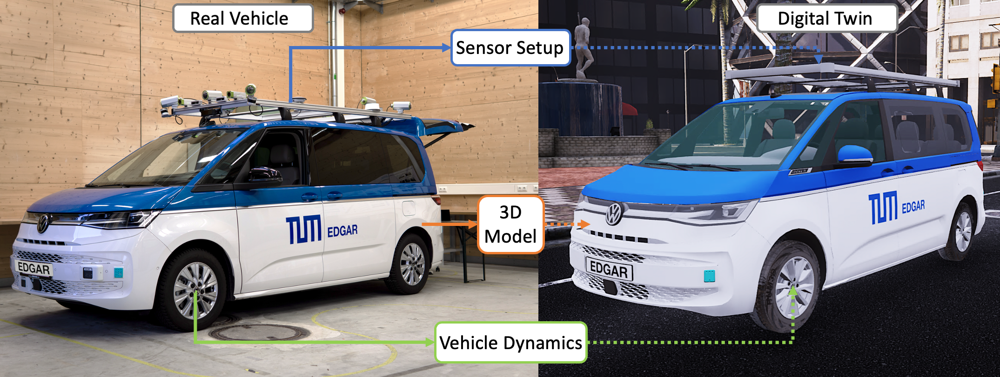
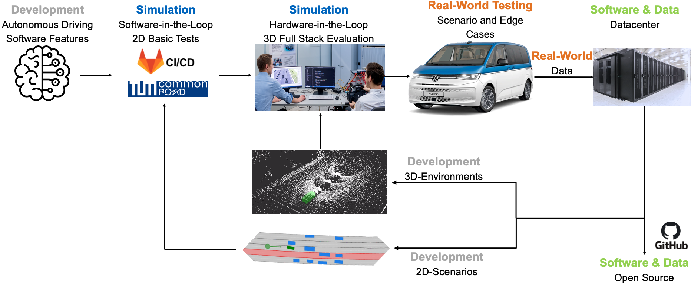

# TUM EDGAR: Digital Twin

Welcome to the TUM EDGAR Digital Twin repository of the Technical University of Munich! Here you find data, parameters, and information related to our [TUM EDGAR research vehicle](https://arxiv.org/pdf/2309.15492.pdf)




## What is a Digital Twin?

A digital twin is a virtual representation of a physical object or system. In the case of our repository, the digital twin serves as a digital counterpart of our autonomous research vehicle. It captures the vehicle's dynamic behavior, performance, and characteristics in a virtual environment. With this information you can simulate the TUM EDGAR autonomous vehicle in various 2D and 3D simulation environments like Carla.

<details>
<summary> <h2> 📁 Repository content and folder structure </h2> </summary>

This repository is organized into the two sections of `source` and `tools`.

* `source` contains all models and parameters of the vehicle.

*  `tools` contains tools to integrate the digital twin in dedicated development and simulation environments.
</details>

<details>
<summary> <h2> 🖥 Source </h2> </summary>

## 3D Models

Here, we provide a 3D model for the autonomous research vehicle body. This model can be integrated into 3D simulations, allowing you to visualize the vehicle and its sensors.
The 3D model files can be found in the folder `3d_model`. We offer a `high_res` 3D model (high resolution models for high fidelity simulation environments) and a `low_res` 3D model (downsampled visual 3D model) for various use cases. See the READMEs in the folders for more details.

## Sensor position parameters

Here, we provide a detailed parameter set that specifies the position (x, y, z) of the sensors in relation to the rear axle (base link) of the autonomous research vehicle.
The `x`, `y`, and `z` values represent the coordinates in meters, indicating the displacement of each sensor from base link along the respective axes.
The parameter set can be found in the file [edgar.urdf](source/sensor_parameter/edgar.urdf) located in the `sensor_parameter` directory. We refer to the [README](source/sensor_parameter/README.md) for further details.


## Vehicle dynamics parameters

Here, we provide a list of parameters that define the vehicle dynamics of our autonomous research vehicle. These parameters can be utilized in various vehicle dynamic models, enabling accurate simulation and analysis of the vehicle's behavior.
The parameter set can be found in the file [vehicle_parameters_edgar.yaml](source/vehicle_dynamics_parameter/vehicle_parameters_edgar.yaml) file located in the `vehicle_dynamics_parameter` directory. Each parameter is listed with its corresponding value and its unit.

<!-- ### Network Parameters -->
</details>

<details>
<summary> <h2> 🔧 Tools </h2> </summary>

## AWSIM
The given tool can be used to integrate our research vehicle as 3D-model in the [AWSIM](https://github.com/tier4/AWSIM) simulation environment by TierIV. A detailed description how to use the tool is given in the [README](tools/AWSIM/README.md).

## CARLA
In this folder you will find the necessary documentation and files for importing EDGAR into the [CARLA](https://carla.org/) Open Source Simulator.

## Edgar State Publisher
By means of the given guide, EDGAR can be visualized in the Robot State Publisher based on the given .urdf-file. A detailed description how to use the tool is given in the [README](tools/edgar_state_publisher/README.md).
 CARLA
</details>


<details>
<summary> <h2> 📇 Contact and Contribution </h2> </summary>
We are welcome interested researchers and developers in the field to contribute to our autonomous driving research. People can integrate the EDGAR digital twin in their simulations and use it to derive results. If you further want to collaborate, we are displaying the TUM EDGAR development pipeline below. Feel free to develop autonomous driving software features or create new 2D or 3D maps.



If you want to work with us on the EDGAR, tests your algorithms on the real car or if you have any questions, feel free to contact our [EDGAR-Team](https://www.mos.ed.tum.de/en/ftm/main-research/intelligent-vehicle-systems/edgar/).

</details>

<details>
<summary> <h2> 📃 Reference and Citation </h2> </summary>

The collected research papers in this repository were used to create the paper
[EDGAR: An Autonomous Driving Research Platform-From Feature Development to Real-World Application](https://arxiv.org/pdf/2309.15492.pdf). If you find the information in this repository useful we would be happy if you cite it based on the following definition:

```bibtex
@inproceedings{edgar2024,
  author = {Phillip Karle and Tobias Betz and Marcin Bosk and Felix Fent and Nils Gehrke and Maximilian Geisslinger and Luis Gressenbuch and Philipp Hafemann and Sebastian Huber and Maximilian Hübner and Sebastian Huch and Gemb Kaljavesi and Tobias Kerbl and Dominik Kulmer and Tobias Mascetta and Sebastian Maierhofer and Florian Pfab and Filip Rezabek and Esteban Rivera and Simon Sagmeister and Leander Seidlitz and Florian Sauerbeck and Ilir Tahiraj and Rainer Trauth and Nico Uhlemann and Gerald Würsching and Baha Zarrouki and Matthias Althoff and Johannes Betz and Klaus Bengler and Georg Carle and Frank Diermeyer and Jörg Ott and Markus Lienkamp},
  Title = {EDGAR: An Autonomous Driving Research Platform -- From Feature Development to Real-World Application},
  Year = {2023},
  Eprint = {arXiv:2309.15492},
}
```
</details>
